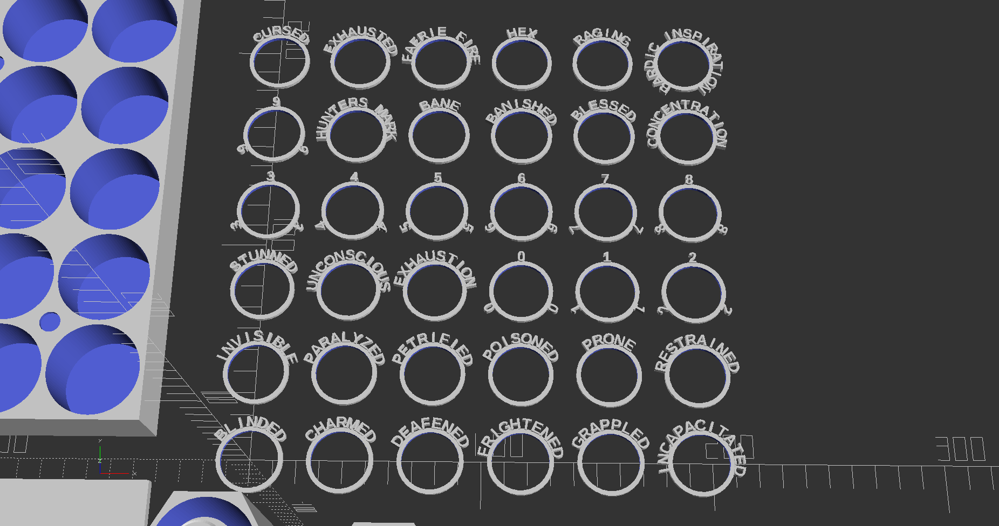
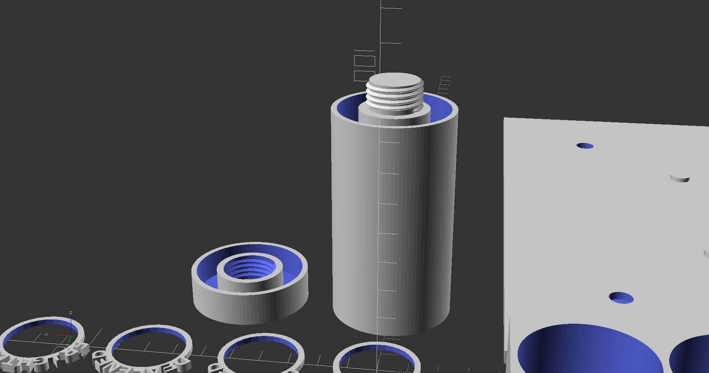
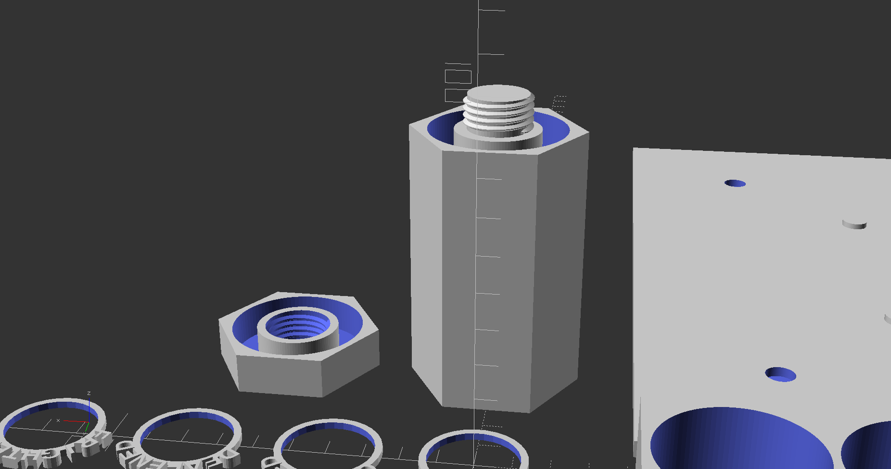
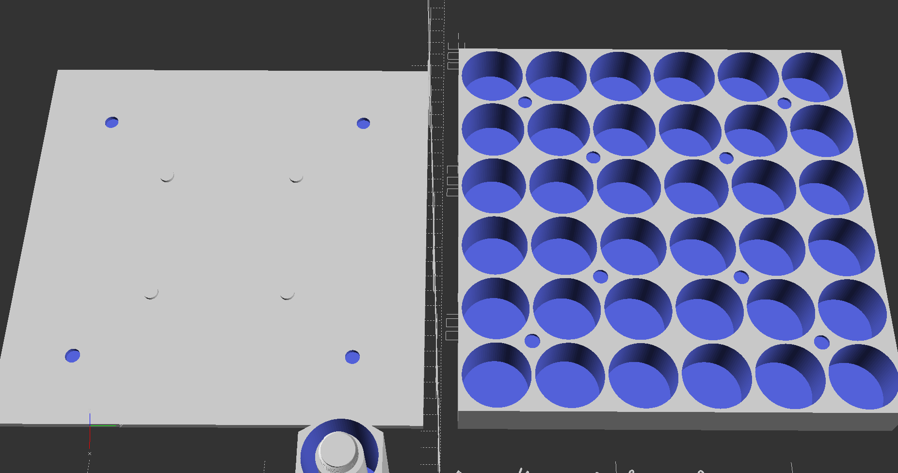

# D&D Condition Rings

A collection of 3D-printable condition rings for Dungeons & Dragons, designed in OpenSCAD.

## Description

These rings are used to track various conditions affecting characters during D&D gameplay, such as poisoned, stunned, concentrating, and more.

## Features

- Customizable designs
- Easy to print on standard 3D printers
- Multiple condition variants

## Container Types

- **Cylindrical**: A standing cylinder with a lid for holding a single combined stack of rings.
- **Hexagonal**: The same as the cylindrical case, except it has 6 sides.
- **Case-style Container**: A flat container with dedicated slots for each type of condition ring, using magnets and alignment pins/holes to keep the lid on.

## Customization Options

- Ring texts
- Ring size and thickness adjustment
- Font and text size
- Optional backplate for the text (coming soon)
- Configurable tolerances and connection sizes
- Adjustable wall thickness for durability

## Files

- Main OpenSCAD source file ([DnD_Condition_Rings.scad](DnD_Condition_Rings.scad))
    - This gets you all the models at once.
- Case Only - ([Case_Only.scad](Case_only.scad))
- Condition Rings Only - ([Condition_Rings_Only.scad](Condition_Rings_Only.scad))
- Standing Container Only - ([Standing_Container_Only.scad](Standing_Container_Only.scad))
- Parts
    - Each model has its own file, and a module which can be called from other OpenSCAD files.

## Usage

1. Open the OpenSCAD files to view or modify the designs
2. Export desired rings and case models as STL files
3. Print using your preferred 3D printer

# Examples

### 3D Model
[3D Model in STL format](Examples/DnD_Condition_Rings.stl)

### The rings

### Cylindrical Container

### Hexagonal Container

### Case-style Container

## License

Shield: [![CC BY-NC 4.0][cc-by-nc-shield]][cc-by-nc]

This work is licensed under a
[Creative Commons Attribution-NonCommercial 4.0 International License][cc-by-nc].

[![CC BY-NC 4.0][cc-by-nc-image]][cc-by-nc]

[cc-by-nc]: https://creativecommons.org/licenses/by-nc/4.0/
[cc-by-nc-image]: https://licensebuttons.net/l/by-nc/4.0/88x31.png
[cc-by-nc-shield]: https://img.shields.io/badge/License-CC%20BY--NC%204.0-lightgrey.svg

You are free to:
- Share — copy and redistribute the material in any medium or format
- Adapt — remix, transform, and build upon the material

Under the following terms:
- Attribution — You must give appropriate credit to the original author.
- NonCommercial — You may not use the material for commercial purposes.
- ShareAlike — If you remix, transform, or build upon the material, you must distribute your contributions under the same license.

For details, see: https://creativecommons.org/licenses/by-nc-sa/4.0/

## Commercial use
Commercial use is not allowed. If you wish to license this work, contact me at [contact@codeslasher.com](mailto:contact@codeslasher.com). 
